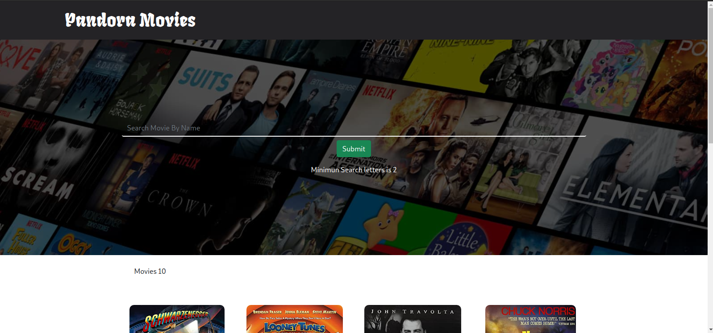
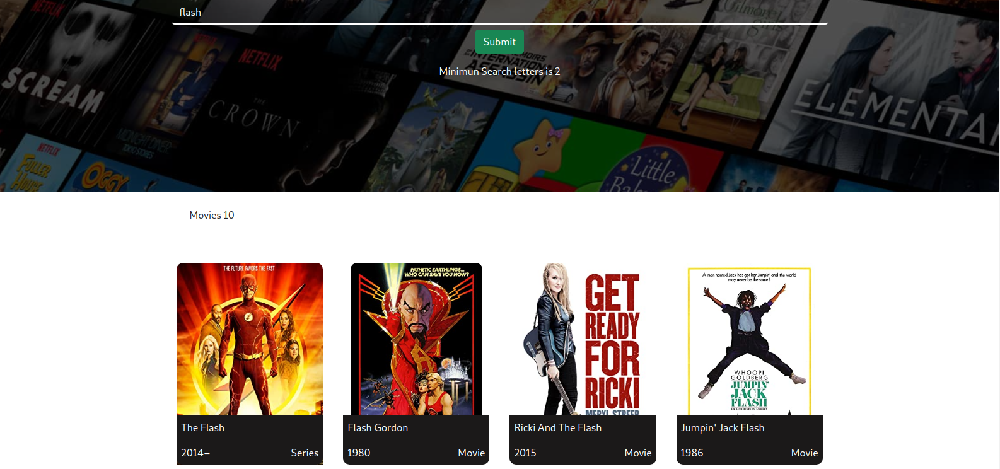

# PandoraMovies

#### By Samuel Maingi Mutunga

## Description 

This is a single page application that displays movies to the user when they search for a movie of their liking.

Landing Page

Search Results for Flash

---

## Access the website
Need the latest browser to be able to View

Follow this link https://layersony.github.io/padoramovies/

It is hosted by github.

---

## Use the website
Click this link https://layersony.github.io/padoramovies/

Key In your desired Movie.

Your Movie will be Displayed in a few

---

### Setup
To access this project on your local files, you can clone it using these steps
1. Open your terminal
1. Use this command to clone `https://github.com/layersony/pandoramovies.git`
1. This will clone the repositoty into your local folder
1. __Enjoy :)__

#### Development server
Make sure you have install `Node Js`, `Angular` & `Node Package Manager`
Run `ng serve` for a dev server. Navigate to `http://localhost:4200/`. The app will automatically reload if you change any of the source files.

## Technologies Used
HTML

CSS

Git

Bootstrap

Angular

Movie API [Link](http://www.omdbapi.com/)

---

## Further help

To get more help on the Angular CLI use `ng help` or go check out the [Angular CLI Overview and Command Reference](https://angular.io/cli) page.

## Contact Details
sammaingi5@gmail.com

---

### License
This Project is under the [MIT](LICENSE) license